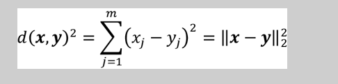
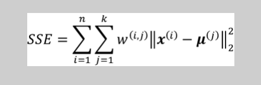
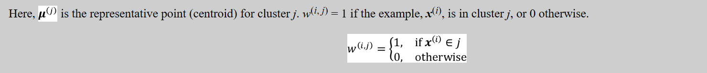
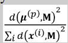

# group_clustering_unsupervised_analysis
knn workd like this: 

    Randomly pick k centroids from the examples as initial cluster centers
      Assign each example to the nearest centroid, 
      Move the centroids to the center of the examples that were assigned to it
      Repeat steps 2 and 3 until the cluster assignments do not change or a user-defined tolerance or maximum number of iterations is reached

To measure the similarity between objects we use for continous featueres,  squared Euclidean distance between two points, x and y, in m-dimensional space:

cluster inertia:

# initializing initial cluster centroid using kmeans
1. Initialize an empty set, M, to store the k centroids being selected.
2. Randomly choose the first centroid, u(i) , from the input examples and assign it to M.
3. For each example, x(i), that is not in M, find the minimum squared distance, d(x(i), M)2, to any of the centroids in M.
4. To randomly select the next centroid, u(p), use a weighted probability distribution equal to . For instance, we collect all points in an array and choose a weighted random sampling, such that the larger the squared distance, the more likely a point gets chosen as the centroid.
5. Repeat steps 3 and 4 until k centroids are chosen.
6. Proceed with the classic k-means algorithm.